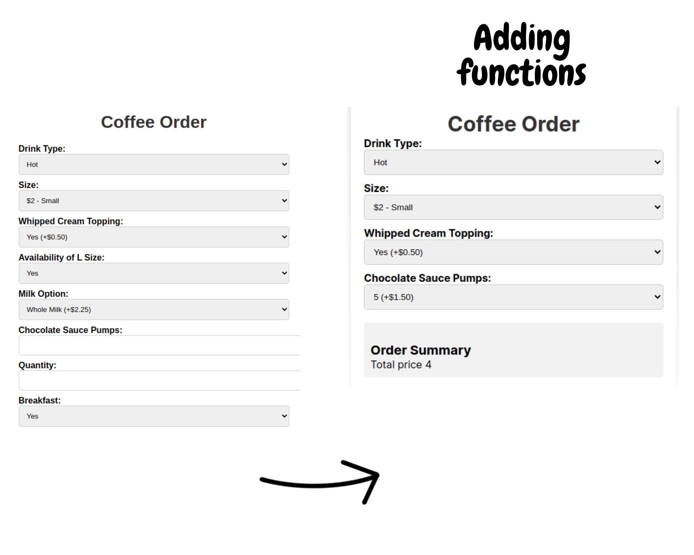
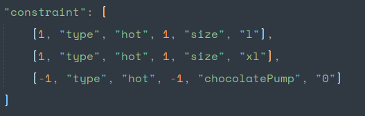

## Outline

1. Project situation
- why I took long time? - care too much about how it look
- start again (make it simple): do with teammate

2. How working with teammate

3. Modeling constraint
- by an array -> expressiond

